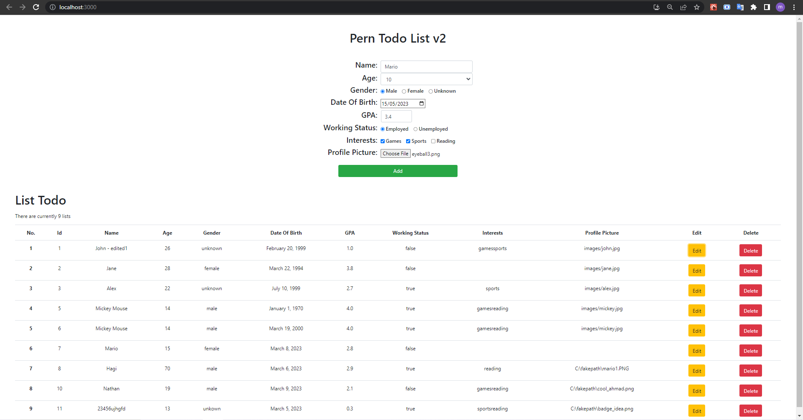
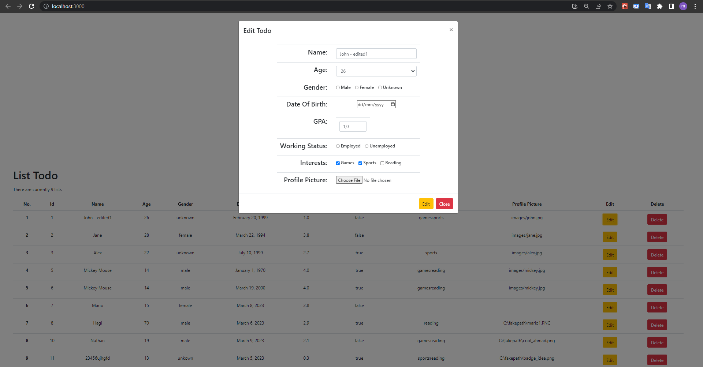

# Second Todo List

Another To Do List. The second one. This is where I experiment with the different kinds of data available. Until I eventually realized there are other ways to make things like Pagination and Data Insertion easier to handle.

Project made by Mario (with some of my own code modifications).

---

Some screenshots:

---

The tutorial video can be found [here](https://www.youtube.com/watch?v=ldYcgPKEZC8&t=3830s).

